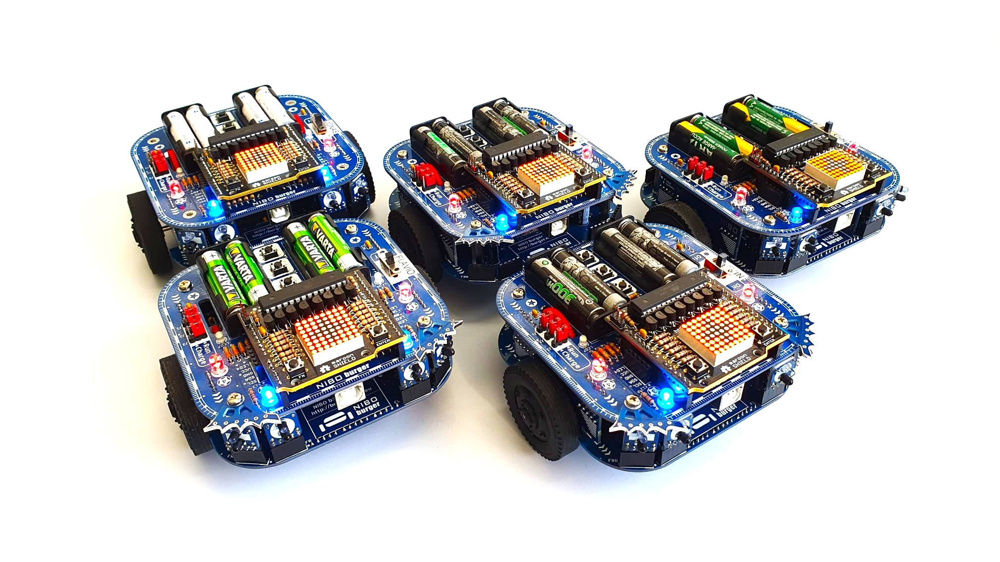
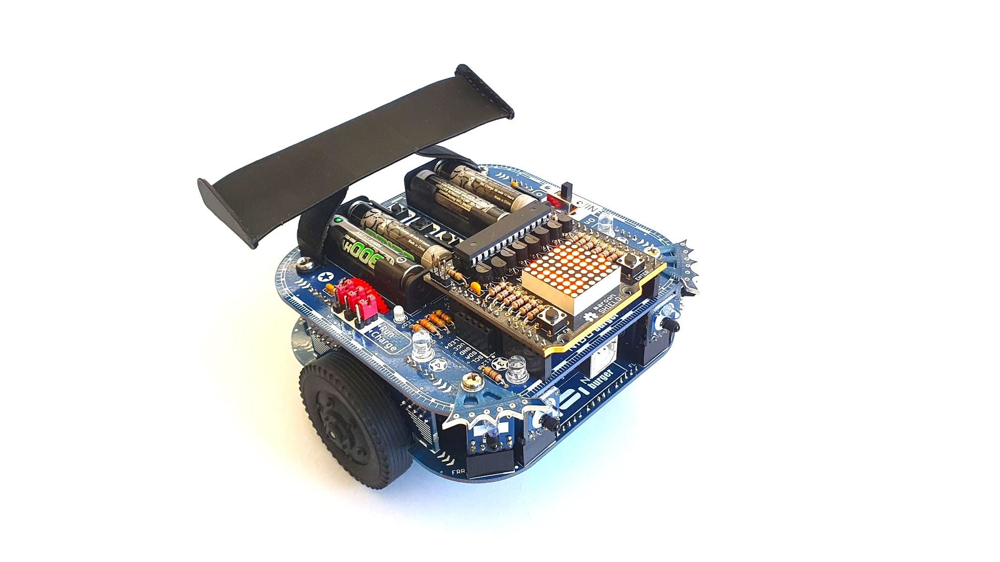
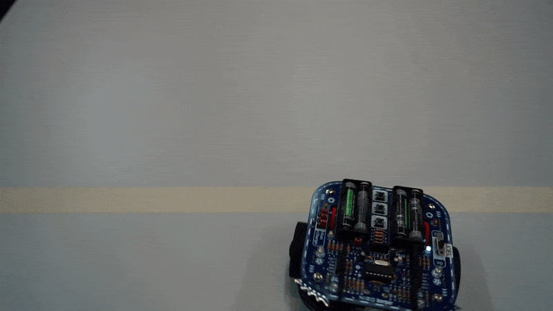
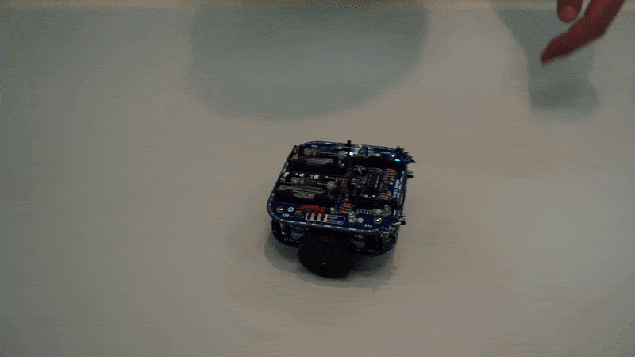

+++
chapter = false
title = "Elektronikprojekt"
weight = 2
+++

## Roboter programmieren für lernende Automatiker

Neben Berufsschule, den überbetrieblichen [Swissmechanic](https://www.swissmechanic.ch/) Kursen und dem praktischen Arbeiten an Aerosol-Anlagen für Kunden aus der ganzen Welt, arbeiten **Automatiker Lernende** bei Pamasol auch an Projekten, welche den Fokus auf ein bestimmtes Ausbildungsthema setzen.

NIBO Burger repräsentiert das **Elektronikprojekt** der Ausbildung. Es handelt sich hierbei um einen kleinen Roboter, welcher von den Lernenden zusammengebaut, **gelötet** und in der [Hochsprache C](https://de.wikipedia.org/wiki/C_(Programmiersprache)) programmiert wird.

Die Aufgabenstellung, wie auch sämtliche Datenblätter und Wiki Beiträge, sind in Englisch geschrieben. Nach dem Zusammenbau und den Funktionstests, erhalten die Lernenden eine Einführung in die **C-Programmierung**. Den Projekthöhepunt bilden die unten folgend beschriebenen «Master-Tasks».

Als Bonusaufgabe wird der Roboter mit **3D-Druck Bauteilen** optisch aufgepeppt. Folgend als exemplarisches Beispiel ein [Heckspoiler](https://a360.co/3FAwiLr).

### A) Round trip
Der Roboter muss genau 1.5m nach vorne fahren, eine 180° Drehung machen und wieder an seinen Startpunkt zurückkehren. Damit das funktioniert, müssen die [Odometrie-Sensoren](https://de.wikipedia.org/wiki/Odometrie) der Räder ausgelesen und verglichen werden. Basierend darauf werden die [PID-geregelten](https://de.wikipedia.org/wiki/Regler#PID-Regler) Motoren angesteuert.

[Aufgabenstellung Round trip (Nibo01_V1.0.pdf)](https://github.com/pamasol/Lehrlingsprojekt-Nibo-Burger/files/3652583/Nibo01_V1.0.pdf)

### B) Fraidy cat
Frontseitig ist der Roboter mit IR-Bricks versehen. Das sind Infrarotsensoren, welche Hindernisse detektieren können. In dieser Aufgabe geht es darum, den Hindernissen auszuweichen.

[Aufgabenstellung Fraidy cat (Nibo02_V1.0.pdf)](https://github.com/pamasol/Lehrlingsprojekt-Nibo-Burger/files/3652584/Nibo02_V1.0.pdf)

### C) Follow me
Im Gegensatz zu Aufgabe B, muss man in Aufgabe C den Hindernissen nicht ausweichen, sondern dem Hindernis folgen. In diesem Fall der menschlichen Hand.

[Aufgabenstellung Follow me (Nibo03_V1.0.pdf)](https://github.com/pamasol/Lehrlingsprojekt-Nibo-Burger/files/3652585/Nibo03_V1.0.pdf)

### D) Colour detection
Mit den [RGB](https://de.wikipedia.org/wiki/RGB-Farbraum) (Rot-Grün-Blau) Farbsensoren müssen die Bodenfarben Schwarz, Weiss, Rot, Gelb, Grün und Blau detektiert sowie auf dem Display angezeigt werden. Das Display läuft eigenständig mit eigenem [Microcontroller](https://de.wikipedia.org/wiki/Mikrocontroller). Der Microcontroller des Roboters kommuniziert via [UART](https://de.wikipedia.org/wiki/Universal_Asynchronous_Receiver_Transmitter) mit dem Microcontroller des Displays.

[Aufgabenstellung Colour detection (Nibo04_V1.1.pdf)](https://github.com/pamasol/Lehrlingsprojekt-Nibo-Burger/files/8169805/Nibo04_V1.1.pdf)

### E) Rabbit warren
In der Königsaufgabe muss der Roboter einer schwarzen Linie auf dem Boden folgen. Die Linie wird mittels Sensoren detektiert und basierend darauf werden die Motoren gesteuert.

[Aufgabenstellung Rabbit warren (Nibo05_V1.0.pdf)](https://github.com/pamasol/Lehrlingsprojekt-Nibo-Burger/files/3652587/Nibo05_V1.0.pdf)

## Dokumentation

Die elektrischen Bauteile sowie gelöteten Schaltkreise und die Programmierung werden von den Lernenden in einer schriftlichen Dokumentation zusammengefasst. Folgend können die PDFs heruntergeladen und nachgelesen werden.

| Name             | Lehrjahr  | Lehrberuf   | Dokumentation   |
| ---------------- | --------- | ----------- | --------------- |
| Marvin Büeler    | 2016-2020 | Automatiker | [Download PDF](./docs/2019-12-16_Nibo_Doku_MarvinBueeler.de.pdf)
| Joel Glaus       | 2017-2021 | Automatiker | [Download PDF](./docs/2020-04-28_Nibo_Doku_JoelGlaus.de.pdf)
| David Bernhard   | 2018-2022 | Automatiker | [Download PDF](./docs/2020-04-28_Nibo_Doku_DavidBernhard.de.pdf)
| Jonas Bisig      | 2018-2022 | Automatiker | [Download PDF](./docs/2022-03-04_Nibo_Doku_JonasBisig.de.pdf)
| Stefan Feier     | 2019-2023 | Automatiker | [Download PDF](./docs/2022-05-12_Nibo_Doku_StefanFeier.de.pdf)
| Nicolas Diethelm | 2020-2024 | Automatiker | [Download PDF](./docs/2022-06-02_Nibo_Doku_NicolasDiethelm.de.pdf)
| Flavio Knobel    | 2020-2024 | Automatiker | [Download PDF](./docs/2022-05-23_Nibo_Doku_FlavioKnobel.de.pdf)
| Kevin Kälin      | 2021-2025 | Automatiker |
| Linus Lacher     | 2022-2026 | Automatiker |

{}
Die Projektbeschreibung in Englisch sowie alle Aufgaben und Hilfestellungen gibt es in folgendem GitHub Repository: https://github.com/pamasol/Lehrlingsprojekt-Nibo-Burger
{}
