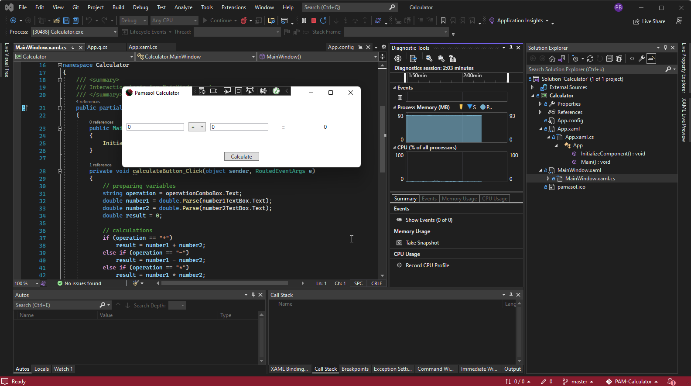
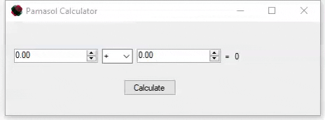

+++
chapter = false
title = "C-Sharp Projekt"
weight = 4
+++

## Taschenrechner als portable *.exe Datei in C# programmieren

Neben Berufsschule, den überbetrieblichen [Swissmechanic](https://www.swissmechanic.ch/) Kursen und dem praktischen Arbeiten an Aerosol-Anlagen für Kunden aus der ganzen Welt, arbeiten **Automatiker Lernende** bei Pamasol auch an Projekten, welche den Fokus auf ein bestimmtes Ausbildungsthema setzen.

PAM-Calculator repräsentiert das **C#-Projekt** der Ausbildung. Es soll Lernende in die **objektorientierte Programmierung** einführen.

Mithilfe der Visual Studio IDE (Integrated Development Environment) wird ein Windows Taschenrechner in C# programmiert. Der Rechner kann zwei Zahlen addieren, subtrahieren, multiplizieren und dividieren. Bei Division durch 0 wird eine Warnung ausgegeben:

Die Exe-Datei, welche erstellt wird, kann auf einem PC mit **Windows Betriebssystem** ausgeführt werden.

Es wird eine Variante in [Winforms](https://de.wikipedia.org/wiki/Windows_Forms) und eine Variante in [WPF](https://de.wikipedia.org/wiki/Windows_Presentation_Foundation) erstellt, wobei beide Varianten im Anschluss verglichen werden.

{}
Die Projektbeschreibung in Englisch sowie alle Aufgaben und Hilfestellungen gibt es in folgendem GitHub Repository: https://github.com/pamasol/PAM-Calculator
{}
