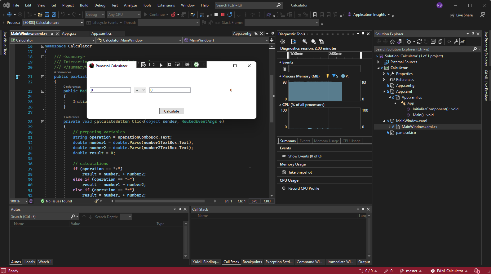
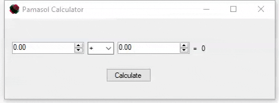

+++
chapter = false
title = "C-Sharp project"
weight = 4
+++

## Programming a calculator as a portable *.exe file in C#

Aside from vocational school, inter-company professional training at [Swissmechanic](https://www.swissmechanic.ch/) and practical work on aerosol machines for customers around the world, **automation engineer apprentices** at Pamasol also work on projects which focus on specific parts of the education.

PAM-Caluclator represents the **C#-project** of the education. Its purpose is to introduce the apprentices into the world of **object oriented programming**.

With the help of Visual Studio IDE (Integrated Development Environment) a windows calculator will be programmed in C#. The calculator can add, subtract, multiply and divide two numbers. If divided by zero, the calculator will show a warning:

The created Exe-file can be executed on a PC with **Windows OS**.

There will be one variant made in [Winforms](https://en.wikipedia.org/wiki/Windows_Forms) and one in [WPF](https://en.wikipedia.org/wiki/Windows_Presentation_Foundation). Afterwards, both variants will be compared.

{}
The project description as well as all excercises and assistance are found in the following GitHub repository: https://github.com/pamasol/PAM-Calculator
{}
