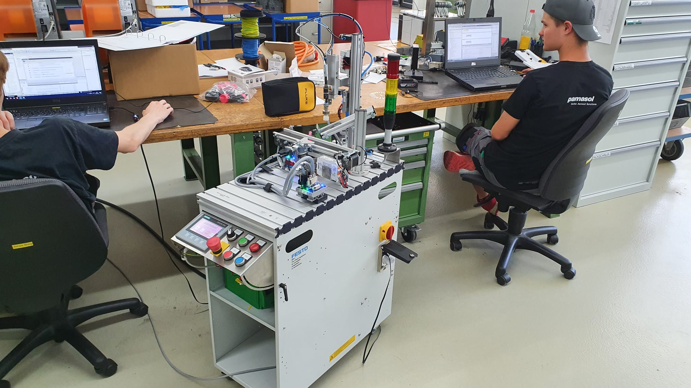

+++
chapter = false
title = "Automatisierungsprojekt"
weight = 3
+++

## Pick&Place Roboter mit Siemens SPS programmieren

Neben Berufsschule, den überbetrieblichen [Swissmechanic](https://www.swissmechanic.ch/) Kursen und dem praktischen Arbeiten an Aerosol-Anlagen für Kunden aus der ganzen Welt, arbeiten **Automatiker Lernende** bei Pamasol auch an Projekten, welche den Fokus auf ein bestimmtes Ausbildungsthema setzen.

Der Pick&Place Roboter repräsentiert das **SPS Automatisierungsprojekt** der Ausbildung. Es handelt sich hierbei um einen pneumatischen Greifer von [Festo Didactic](https://www.festo-didactic.ch/).

Der Roboter wird durch eine Siemens ET200SP [SPS (Speicherprogrammierbare Steuerung)](https://de.wikipedia.org/wiki/Speicherprogrammierbare_Steuerung) gesteuert. Programmiert wird die SPS mit dem **Siemens [TIA Portal](https://de.wikipedia.org/wiki/Totally_Integrated_Automation)**, wobei man zwischen folgenden Programmiersprachen wählen kann:

* Anweisungsliste AWL
* Kontaktplan KOP
* Funktionsplan FUP
* Structured Control Language SCL
* S7-Graph AS

Die Lernenden erstellen mit Hilfe von [YoutTube Videos](https://youtube.com/playlist?list=PL1Wj1AOhKEuW5Cr9EzuF_BXwfh-ts8Ttw) ein SPS Programm inklusive Visualiserung auf einem Touch-Panel. Das Progamm **setzt Behältern einen Deckel auf**, ähnlich wie es Pamasol bei den Aerosol-Anlagen macht. Dort werden Spraydosen mit einem Ventil, Sprühkopf und einer Kappe bestückt.
