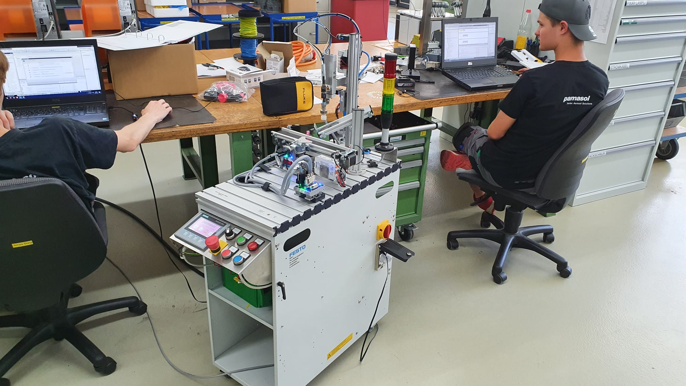

+++
chapter = false
title = "Automation project"
weight = 3
+++

## Programming a Pick&Place robot with a Siemens PLC

Aside from vocational school, inter-company professional training at [Swissmechanic](https://www.swissmechanic.ch/) and practical work on aerosol machines for customers around the world, **automation engineer apprentices** at Pamasol also work on projects which focus on specific parts of the education.

The Pick&Place robot represents the **PLC automation project** of the education. It consists of a pneumatic claw from [Festo Didactic](https://www.festo-didactic.ch/).

The robot is controlled by a Siemens ET200SP [PLC (programmable logic controller)](https://en.wikipedia.org/wiki/Programmable_logic_controller). The PLC is programmed with the **Siemens [TIA Portal](https://new.siemens.com/global/en/products/automation/industry-software/automation-software/tia-portal.html)**, where you can choose between the following coding languages:

* Instruction list IL
* Ladder logic
* Function block diagram FBD
* Structured Control Language SCL
* S7 graph AS

The apprentices create with the help of [YoutTube Videos](https://youtube.com/playlist?list=PL1Wj1AOhKEuW5Cr9EzuF_BXwfh-ts8Ttw) a PLC program including the visualization of a touch panel. The program **places lids on containers**, similarly like the aerosol machines at Pamasol. Here spray cans get assembled with a valve, spray button or a cap.