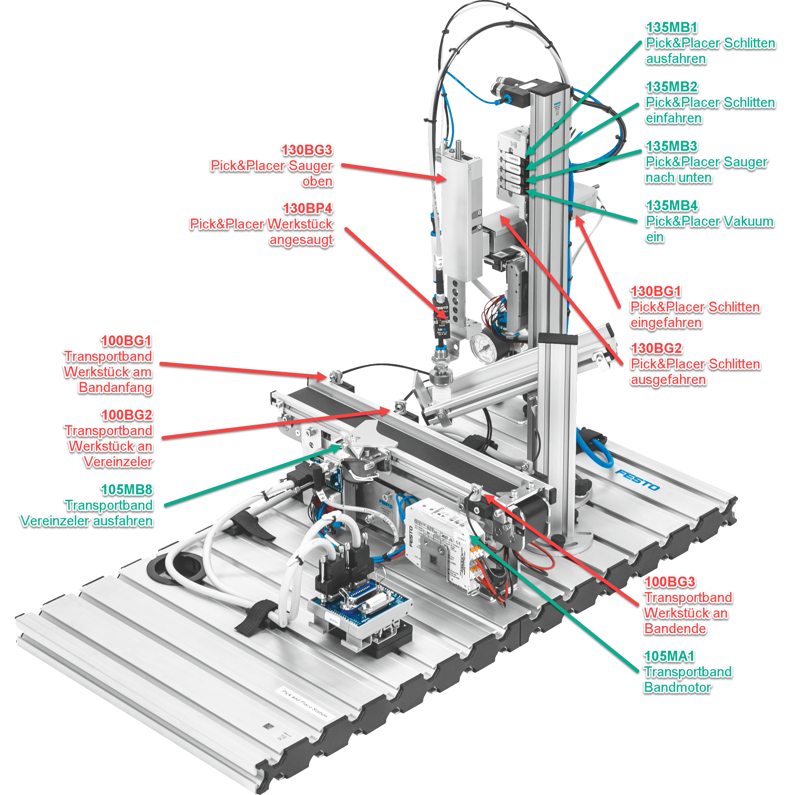

+++
title = "Aufgabenstellung"
weight = 1
+++

## Beschreibung des Programmablaufes

Wie in der Animation oben gezeigt, soll der Pick&Placer folgendermassen programmiert werden, inklusive Visualisierung am Bedienpanel.

1. Zu Beginn ist der Pick&Placer eingefahren und das Förderband steht.
2. Der Operator platziert einen Behälter auf dem Förderband bei der Einlauflichtschranke 100BG1 und drückt den Taster Start.
3. Der Behälter wird bis zum Vereinzeler gefördert und dort gestoppt.
4. Der Pick&Placer fährt nach unten, saugt beim Deckelmagazin einen Deckel an, fährt wieder nach oben, nach vorne und nach unten über den Behälter.
5. Vakuum wird gelöst und somit Deckel aufgesetzt.
6. Der Pick&Placer fährt wieder in die Startposition.
7. Der Vereinzeler lässt den Behälter mit aufgesetztem Deckel weiterfahren.
8. Kommt der Behälter an der Rückstau Lichtschranke 100BG3 an, stoppt das Förderband.

Die Positionen der wichtigsten Sensoren können folgender Grafik entnommen werden.

{}
Das Elektroschema des Steuerschranks kann [hier als PDF](./docs/Pick_and_Placer_4_eView-5.de.pdf) heruntergeladen werden
{}

## Dokumentation

Die mit Kommentaren versehenen Projekte können als TIA Archivdatei (`*.zap16`, `*.zap17` usw.) aus folgender Tabelle heruntergeladen werden.

| Name             | Lehrjahr  | Lehrberuf   | Programm        |
| ---------------- | --------- | ----------- | --------------- |
| Stefan Feier     | 2019-2023 | Automatiker |
| Nicolas Diethelm | 2020-2024 | Automatiker | [Download ZAP16](./docs/NicolasDiethelm/ND_PiPl_20220809_0738.zap16)
| Flavio Knobel    | 2020-2024 | Automatiker | [Download ZAP16](./docs/FlavioKnobel/FK_PiPl_20220809_0739.zap16)
| Kevin Kälin      | 2021-2025 | Automatiker |
| Linus Lacher     | 2022-2026 | Automatiker |
