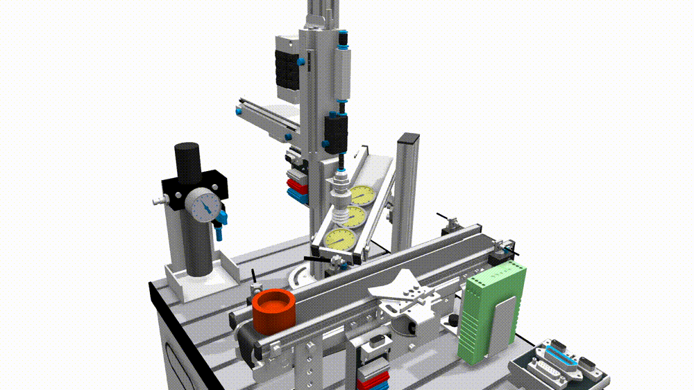
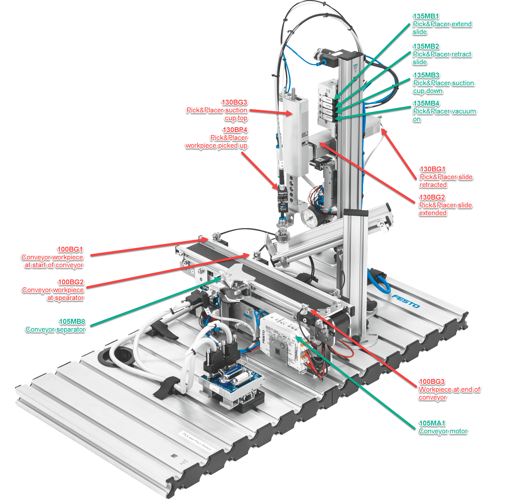

+++
title = "Definition of task"
weight = 1
+++

## Desrciption of process flow

As shown in the animation above, the Pick&Placer should be programmed as follows, including the visualization of the touch panel.

1. At first the Pick&Placer is retracted and the conveyor is not running
2. The operator places a container on the conveyor at the inlet light barrier 100BG1 and presses the button Start.
3. The container gets transported to the separator and stops there
4. The Pick&Placer moves down, sucks a lid from the magazine, moves up and to the front and down again on top of the container.
5. The vacuum gets released and as such places the lid on the container.
6. The Pick&Placer moves to the start position.
7. The separator lets the container with the placed lid move ahead.
8. As sson as the container reaches the light barrier 100BG3, the conveyor stops.

The positions of the most relevant sensors are shown below:

{}
The electrical diagram of the control cabinet can be downloaded [here as a PDF](./docs/Pick_and_Placer_4_eView-5.en.pdf)
{}

## Documentation

The projects with all the comments can be downloaded as a TIA archive file (`*.zap16`, `*.zap17` etc.) from the following file.

| Name             | Date      | Profession          | Program         |
| ---------------- | --------- | ------------------- | --------------- |
| Stefan Feier     | 2019-2023 | automation engineer |
| Nicolas Diethelm | 2020-2024 | automation engineer | [Download ZAP16](./docs/NicolasDiethelm/ND_PiPl_20220809_0738.zap16)
| Flavio Knobel    | 2020-2024 | automation engineer | [Download ZAP16](./docs/FlavioKnobel/FK_PiPl_20220809_0739.zap16)
| Kevin Kälin      | 2021-2025 | automation engineer |
| Linus Lacher     | 2022-2026 | automation engineer |
