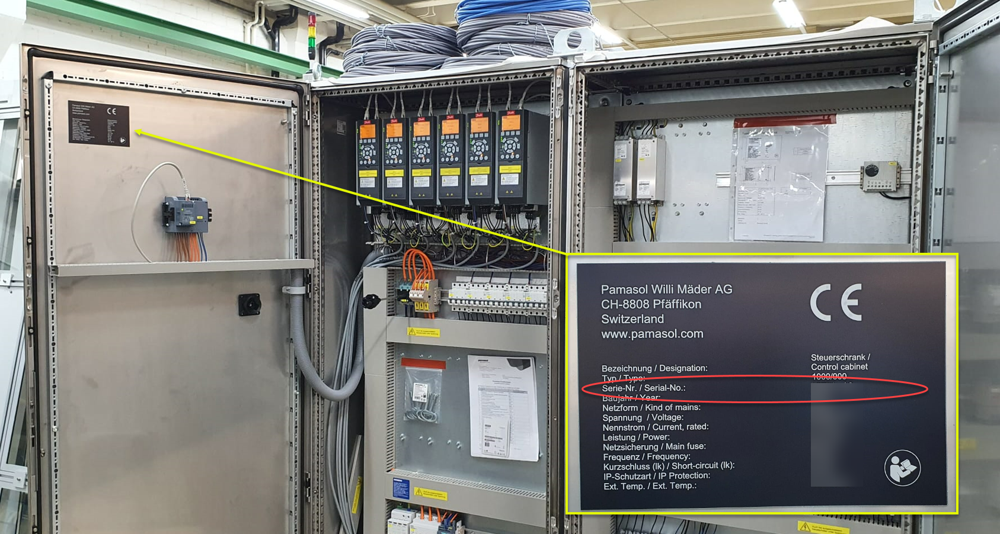

+++
title = "Anfrage vorbereiten"
weight = 1
+++

## Informationen sammeln vor der Supportanfrage

In einem ersten Schritt muss das After-Sales Team die **Seriennummer** der betroffenen Maschine kennen. Im Falle eines Problems mit Elektrotechnik oder Software ist die Seriennummer des Schaltschranks entscheidend. Diese findet man auf dem Typenschild, welches auf der Türe ganz Link an der Innenseite angebracht ist. Siehe dazu folgendes Bild. Ein Beispiel für eine Seriennummer ist 12345-A1.

In einem zweiten Schritt muss der Fehler oder die Störung beschrieben werden. Im Idealfall hat man eine Antwort auf folgende Fragen:

1. Werden auf dem **Touch-Panel Fehlermeldungen oder Warnungen** angezeigt? Leuchtet an einer Bedienstelle oder einer Turmleuchte eine rote oder gelbe LED?

2. Wie unterscheidet sich das **Verhalten der Anlage** von der normalen Produktion? Läuft die Anlage gar nicht oder nur eingeschränkt?

3. Um welche **Uhrzeit** trat der Fehler auf? Ist der Fehler das erste Mal aufgetreten oder gab es das Problem schon früher?

4. Wurde vor dem Auftreten des Fehlers **etwas geändert an der Anlage**? Gab es beispielsweise einen Formatwechsel, Wartungsarbeiten, Schichtwechsel oder wurde das Rezept umgestellt?

5. War man zu einem **früheren Zeitpunkt in Kontakt** mit dem After-Sales Team bezüglich dieser Anlage?

6. **Was wurde bereits unternommen** zur Behebung der Störung? Respektive was wurde bereits getestet und geprüft?

7. Ist Pamasol in Bezug auf **Hard- und Software auf dem neusten Stand**? Wurden Änderung gemacht, ohne Pamasol zu involvieren? Beispielsweise eine Verdrahtungsänderung im Schaltschrank oder ein Wechsel eines Sensors oder Frequenzumformers?

8. Können **Fotos und Videos** zusammen mit der Fehlerbeschreibung bereitgestellt werden?

{}
Die Pamasol After-Sales Abteilung kann via E-Mail [after-sales@pamasol.com](after-sales@pamasol.com) oder Telefon [+41 55 417 40 40](tel:+41554174040) kontaktiert werden.
{}
