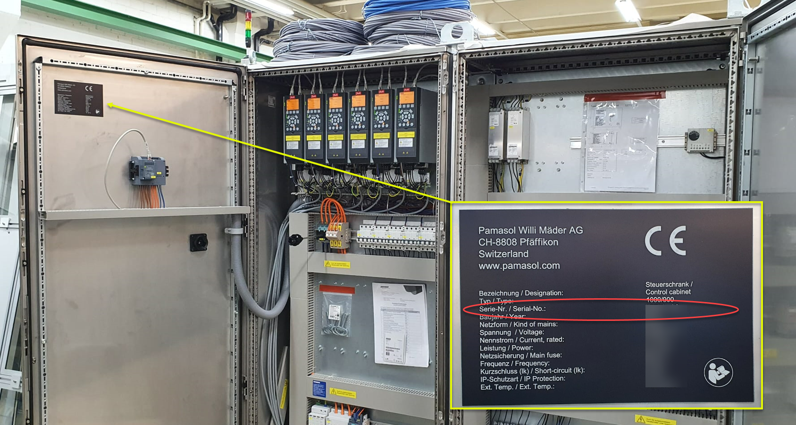

+++
title = "Prepare inquiry"
weight = 1
+++

## Collect information before contacting support

In a first step the after sales team member needs to know the **serial number** of the affected machine. In case of an electrical or software issue, it can be found in the main control cabinet on the most left door inside. See image below. An example for a serial number could be 12345-A1.

In a second step try to describe the error or malfunction. You should also ask yourself or your team mates the following questions:

1. Do you see any error **messages or warnings on the HMI**? Does a red or yellow LED light up on a control panel or a stack light?

2. How does the **machine behavior** differ from normal production? Does the machine not run at all or with limited functionality?

3. At **what time** did the error occur? Did it happen for the first time or has the issue been existing before already?

4. Has **something been changed prior** to the error occurrence? For example, was there a changeover, centerlining, servicing, shift change, recipe change?

5. **Have you been in contact** with the after sales team regarding this machine or this issue **in the past** already?

6. Has some **troubleshooting been performed already**? If so, what has been tested or checked?

7. Is Pamasol **up to date regarding hard- and software** or have some modifications been done without involving Pamasol? For example a wiring change in the control cabinet or a sensor replacement.

8. Can **photos and videos** be provided along with the error description?

{}
The Pamasol after sales team can be reached via email [after-sales@pamasol.com](after-sales@pamasol.com) or phone [+41 55 417 40 40](tel:+41554174040).
{}
