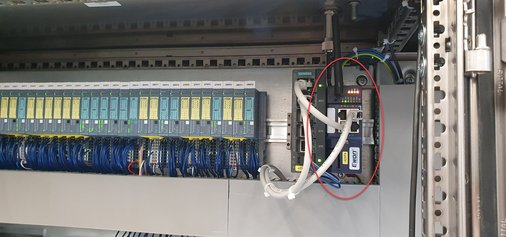
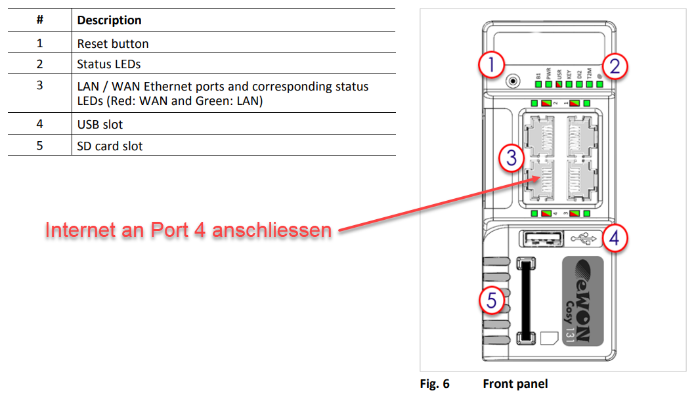
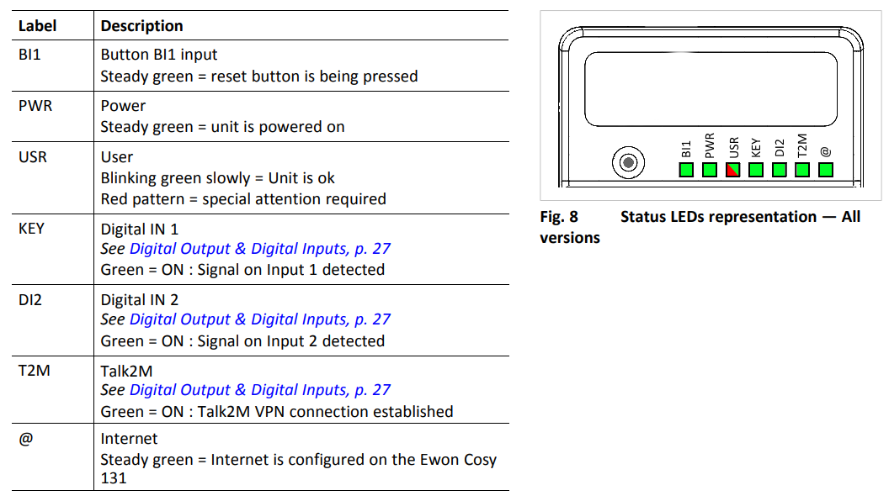
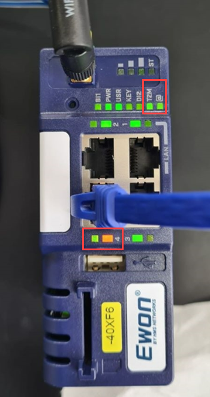

+++
title = "Fernwartung"
weight = 2
+++

## Fehleranalyse und Support via Fernwartung

Die meisten Anlagen sind mit einem **Fernwartungsmodul** ausgestattet, welches eine sichere Verbindung via Internet von der Anlage zum Pamasol-Techniker herstellt.

Es handelt sich grösstenteils um ein blau gefärbtes Gerät von den Herstellern «EWON» oder «VIPA», welches im Hauptschaltschrank eingebaut ist. Das folgende Bild zeigt ein EWON Gateway.

**Suchen Sie nach dem Fernwartungsmodul** im Schaltschrank und verbinden Sie das Ethernet Kabel, welches eine **Internetverbindung** bereitstellt, mit **Port Nummer 4** (WAN Port), wie folgend gezeigt.

Bei einigen Modems ist zusätzlich ein Drehschalter eingebaut, mit welchem der Internetzugang des Modems hardwaremässig abgeschaltet werden kann. Prüfen Sie, ob dieser Schalter eingeschaltet ist.

Folgende Status LEDs müssen leuchten, damit das Modem korrekt arbeiten kann:

* **PWR** = Dauerhaft grün
* **USR** = Langsam blinkend grün
* **T2M** = Dauerhaft grün
* **@**   = Dauerhaft grün

Das folgende Bild zeigt ein Modem, welches sich erfolgreich verbinden konnte. Zum einen leuchtet die **@-LED**, welche für Internetverbindung steht. Zum anderen leuchtet auch die **T2M-LED**, welche die erfolgreiche Anmeldung auf dem Fernwartungsserver anzeigt. Die orange LED beim RJ45 Stecker leuchtet permanent, während die grüne LED kurzzeitig unterbricht (Visualisierung Kommunikation).

## Firewall Einstellungen

Normalerweise muss **Ihre IT-Abteilung** nichts tun, damit sich das Modem mit dem Server verbinden kann. Der VPN-Tunnel wird vom Modem initiiert. Es gibt nur eine ausgehende Verbindung (**HTTPS-Port 443** oder **UDP-Port 1194**) und keine eingehenden Verbindungen. Deshalb müssen in der Firewall keine Ports freigegeben werden.

Weitere Informationen zur Verbindung gibt es [in diesem Dokument in Englisch](docs/faq_remote_access.en.pdf).

{}
Wenn es Verbindungsprobleme gibt (und LED T2M nicht leuchtet), wird empfohlen, die URL `*.talk2m.com` von Ihrer IT-Abteilung auf die Whitelist zu setzen.
{}

{}
Wenn die IT-Abteilung keine Internetverbindung über das Firmennetzwerk zulässt, kann alternativ ein **GSM-Modem** verwendet werden. In diesem Fall sind Firmennetzwerk und Anlage strikt getrennt.
{}
