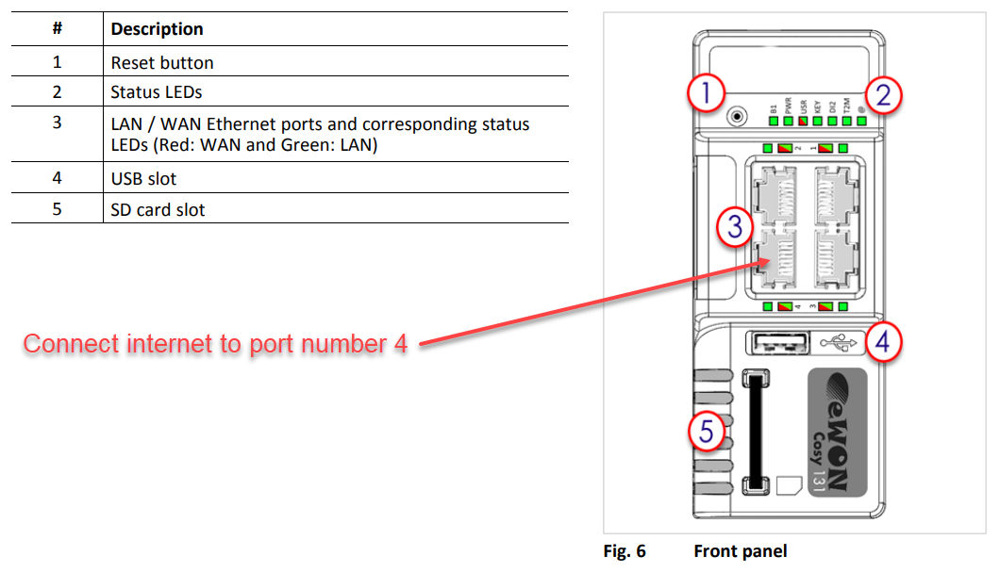
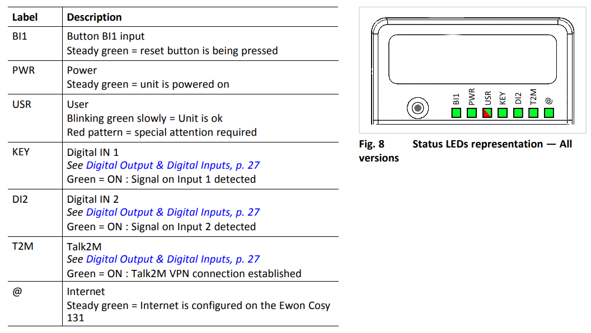
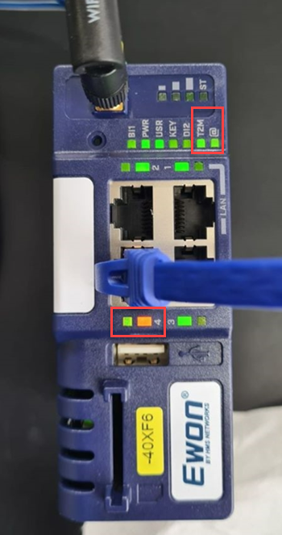

+++
title = "Remote servicing"
weight = 2
+++

## Let a software engineer check your machine remotely

Most Pamasol machines are equipped with a secure industrial **remote access device**. In many cases it is a blue colored unit with the label "EWON" or "VIPA" that can be found in the main control cabinet. The following picture shows the modem which acts as a VPN router.

**Locate this device** in your control cabinet and provide internet connection via Ethernet cable if it hasn't been done already. The RJ45 **cable with internet connection** needs to be connected to **port number 4**, which is the WAN port, as shown below.

Some modems come with a 2 position knob rotary switch, where internet access can be switched on and off hardware wise. Check if it is switched on.

Following LEDs need to light green:

* **PWR** = Steady green
* **USR** = Blinking green slowly
* **T2M** = Steady green
* **@**   = Steady green

The image below shows a modem that connected successfully. There is an **internet connection (@)** and it was able to **register at the server (T2M)**. The orange LED below the RJ45 port lights up constantly whereas the green LED lights up almost all the time (short interruptions that visualize the communication).

## Firewall settings

Typically, **your IT department** needs to do nothing for using the modem. The VPN tunnels are initiated by the router and use only outgoing connections. No incoming connections are made, so no ports need to be enabled in your corporate firewall for incoming connections. In addition, it is designed to be minimally intrusive by using outgoing ports that are usually already enabled (**HTTPS port 443** or **UDP port 1194**).

See also the PDF-file ["FAQ - Remote Access"](docs/faq_remote_access.en.pdf) for further explanation.

{}
If there are any connection  issues (and therefore T2M does not light), it is reccomeneded, **whitelisting** URL `*.talk2m.com` by your IT department.
{}

{}
If the IT department does not provide internet connection via company network, a **GSM modem** can be used as well. In this case the company network and the machine are strictly separated.
{}
