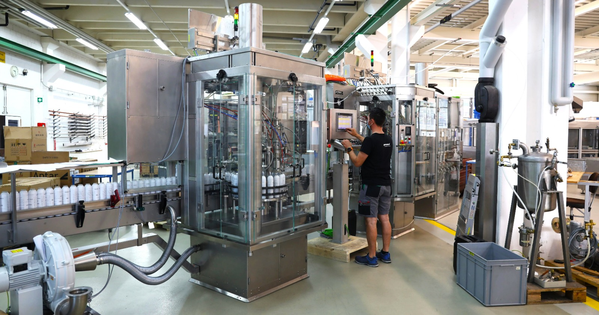

+++
chapter = false
title = "Trial apprenticeship"
weight = 1
+++

## The best machines for spray cans worldwide

Are you interested in the profession of an **automation engineer**? Go ahead, sign up for a trial apprenticeship and you'll get a first-hand experience of the fascinating world of engineering - starting with **mechanical processing** and assembly, through **wiring** of electrical components all the way to **pneumatic controls** and **software engineering**.

The upper picture shows a Pamasol employee testing a **Macromat LB20**. This is a filling and sealing machine for spray cans. While the polymechanics and metal workers are working on the mechanic and metalwork, the **automation engineer** mounts all the electrical components such as **sensors, motors** and the big **touchscreen**. Afterwards, the **PLC** (that's the computer and thus the brain of the machine) gets **programmed** to bring life to the machine.

As soon as the machine is running and the customer finished his checklist, it will be shipped to the production site, for example Australia, the US or Brasil, but also Germany or Switzerland. Pamasol machines are located **all around the world**, producing billions of spray cans.

Fully trained automation engineers have the opportunity to visit different **countries and cultures**, because the machines scattered around the world are installed and serviced by Pamasol employees on site.

You probably haven't noticed it, but you definitely had a spray can in your hand that was filled on a Pamasol machine (deodorant, color spray, oven cleaner, shaving cream, room spray, silicone spray, oil spray, ...the list goes on and on).

A few answers to frequently asked questions:

### Is an automation engineer a demanded profession?

Yes, automation engineers are **professions in high demand** and will continue to be in the future.

More and more tasks and operations are done by machines and robots. Automation engineers are needed to build the machines and program the software for it.

### How long does an apprenticeship take and where do I need to go to school?

The apprenticeship lasts **4 years**. During this time the apprentices will visit one to two days a week the [vocational school](https://www.bbzg.ch/) **in Arth-Goldau**. If you attend the **Federal Professional Baccalaureate** during the apprenticeship, the school visit consists of two days a week for the entire apprenticeship.

Additionally to the vocational school you will attend inter-company professional training in the training centre [Swissmechanic](https://sz.swissmechanic.ch/ausbildungszentrum) in Pfäffikon SZ. These trainings take a few weeks each.

### What kind of advanced training opportunities are there?

There are alot of advanced training opportunities, such as the Federal Diploma of Higher Education for the **automation specialist** or the Advanced Federal Diploma of Higher Education for the **Master in Switchgear and Automation**.  

The most wanted advanced trainings from Pamasol automation engineers so far are the **Technician** ([CHF - College of Higher Education](https://www.sbfi.admin.ch/sbfi/de/home/bildung/hbb/hoehere-fachschulen.html)) or the study for the title **Engineer** ([University of Applied Sciences](https://www.sbfi.admin.ch/sbfi/de/home/hs/hochschulen/kantonale-hochschulen/fh-ph/die-fachhochschulen-der-schweiz.html)).

If you completed the Federal Professional Baccalaureate, you can for example attend the [ost.ch](https://www.ost.ch/en/) in Rapperswil to study for the Engineer.

### How much do you earn as a fully trained automation engineer?

There are no hard and fast rules about how much you earn. Alot of factors play into that, such as work experience, function and position in the workplace or location and branch of the company.

What's definitively in every job: If you love it and put the effort into it, it will mirror into your paycheck.

I know, the answers above do not help alot and we can't keep interested people guessing. Following are a few numbers from the online portal jobs.ch which can give you an estimated point of reference.

**Automation engineer**
* [Jobs.ch for automation engineers](https://www.jobs.ch/en/salary/?canton=ch&term=automatiker), called on 11.01.2023.
* CHF 65'200 annual salary, which, for 12 months, would be **CHF 5433.33** each month.

**Electrical engineer**
* [Jobs.ch for electrical engineers](https://www.jobs.ch/en/salary/?canton=ch&term=elektroingenieur), called on 11.01.2023
* CHF 96'995 annual salary, which, for 12 months, would be **CHF 8082.92** each month.

### Video automation engineer VET

  

### How many automation engineers did Pamasol already train?

| #  | Name                | Date        | Profession         |
| -- | ------------------- | ----------- | -------------------|
| 50 | Stefan Feier        | 2019 - 2023 | automation engineer|
| 49 | Jonas Bisig         | 2018 - 2022 | automation engineer|
| 48 | David Bernhard      | 2018 - 2022 | automation engineer|
| 47 | Joël Glaus          | 2017 - 2021 | automation engineer|
| 46 | Marvin Büeler       | 2016 - 2020 | automation engineer|
| 45 | Elias Kälin         | 2015 - 2019 | automation engineer|
| 44 | Fabian Suter        | 2014 - 2018 | automation engineer|
| 43 | Sven Faas           | 2013 - 2017 | automation engineer|
| 42 | Lukas Kägi          | 2012 - 2016 | automation engineer|
| 41 | Roman Feusi         | 2011 - 2015 | automation engineer|
| 40 | Tom Lauper          | 2010 - 2014 | automation engineer|
| 39 | Maurus Meier        | 2009 - 2013 | automation engineer|
| 38 | Andreas Kälin       | 2008 - 2012 | automation engineer|
| 37 | Simon Schätti       | 2007 - 2011 | automation engineer|
| 36 | Silvan Donner       | 2006 - 2010 | automation engineer|
| 35 | Urban Bruhin        | 2005 - 2009 | automation engineer|
| 34 | Michel Keller       | 2004 - 2008 | automation engineer|
| 33 | Pascal Kälin        | 2003 - 2007 | automation engineer|
| 32 | Matthias Bamert     | 2002 - 2006 | automation engineer|
| 31 | Roger Kälin         | 2002 - 2006 | automation engineer|
| 30 | Philipp Bruhin      | 2001 - 2005 | automation engineer|
| 29 | André Kälin         | 2000 - 2004 | automation engineer|
| 28 | Yves Gautschi       | 1999 - 2003 | automation engineer|
| 27 | Ernst Späni         | 1998 - 2002 | automation engineer|
| 26 | Patrick Lechner     | 1998 - 2002 | automation engineer|
| 25 | Andreas Schuler     | 1997 - 2001 | electro mechanic   |
| 24 | Eric Ziegler        | 1997 - 2001 | electro mechanic   |
| 23 | Ralph Kühn          | 1996 - 2000 | electro mechanic   |
| 22 | Beat Ziegler        | 1996  -2000 | electro mechanic   |
| 21 | Reto Inderbitzin    | 1995 - 1998 | electro mechanic   |
| 20 | Christof von Allmen | 1994 - 1998 | electro mechanic   |
| 19 | Patrick Kühne       | 1994 - 1998 | electro mechanic   |
| 18 | Roman Späni         | 1993 - 1997 | electro mechanic   |
| 17 | Reto Bachmann       | 1992 - 1996 | electro mechanic   |
| 16 | Marco Kälin         | 1992 - 1996 | electro mechanic   |
| 15 | Andreas Knobel      | 1992 - 1996 | electro mechanic   |
| 14 | Martin Ruoss        | 1992 - 1994 | electro mechanic   |
| 13 | Marco Räber         | 1991 - 1995 | electro mechanic   |
| 12 | Kessler Patrick     | 1990 - 1994 | electro mechanic   |
| 11 | Marco Corvi         | 1989 - 1993 | electro mechanic   |
| 10 | Michael Kistler     | 1989 - 1993 | electro mechanic   |
| 9  | Patrik Diethelm     | 1988 - 1992 | electro mechanic   |
| 8  | Michael Manser      | 1988 - 1992 | electro mechanic   |
| 7  | Daniel Schätti      | 1986 - 1990 | electro mechanic   |
| 6  | Oskar Mäder         | 1985 - 1989 | electro mechanic   |
| 5  | Edgar Pfister       | 1985 - 1989 | electro mechanic   |
| 4  | Armin Zonder        | 1984 - 1988 | electro mechanic   |
| 3  | Peter Pedros        | 1982 - 1986 | electro mechanic   |
| 2  | Josef Schnüriger    | 1980 - 1984 | electro mechanic   |
| 1  | Reto Hegner         | 1978 - 1982 | electro mechanic   |

{}
On the [official website of Pamasol](https://www.pamasol.com/en/who-are-we#working-for-pamasol#panel729) you can inquire the professions we provide on your own.
{}

{}
Contact Andreas Rüttimann [andreas.ruettimann@pamasol.com](andreas.ruettimann@pamasol.com) or phone [+41 55 417 40 40](tel:+41554174040) to sign up for an apprenticeship as an automation engineer.
{}
