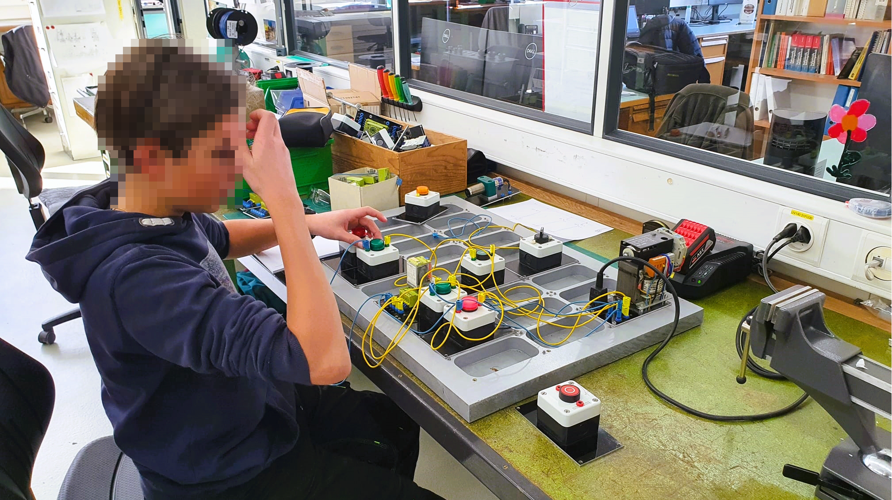
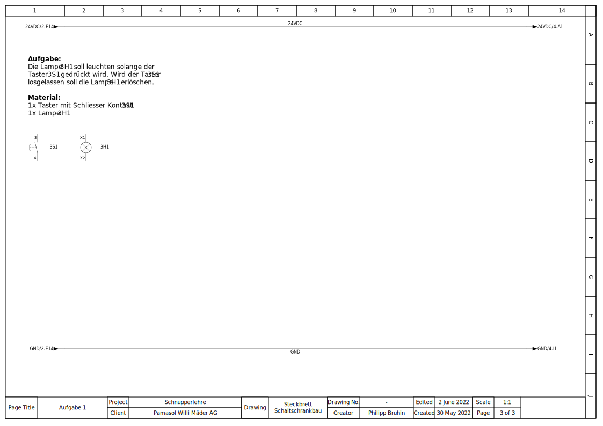

+++
chapter = false
title = "Schaltschrank Steckbrett"
weight = 2
+++

## Elektroschema zeichnen und verdrahten

Zu den wichtigsten Aufgaben des Automatikers zählt das **Planen** und **Verdrahten von Steuerschränken**. Diese Steuerschränke können mal die Grösse einer Schuhschachtel und mal die Grösse von vier aneinandergereihten, grossen Kleiderschränke haben.

Gefüllt sind die Schränke mit komplexer **Elektronik**, welche mittels **Litzen** (flexible Drähte) verbunden werden. Ist von den vielen hundert Litzen nur eine falsch angeschlossen, läuft die Anlage nicht. Im dümmsten Fall gehen sogar Bauteile kaputt, welche so teuer sind wie ein Auto.

Beim Zeichnen des Schemas sowie beim Verdrahten ist somit höchste Konzentration und Vorsicht geboten. Allem voran kommt jedoch das Üben – und genau das wird bei dieser Aufgabe gemacht.

### Elektroschema zeichnen via Capital Electra X

Im professionellen Umfeld werden Elektroschemas auf Programmen wie [EPLAN P8](https://www.eplan.com/), [Zucken E3](https://www.zuken.com/) oder [WS-CAD](https://www.wscad.com/) gezeichnet.

Für das folgende Projekt empfehlen wir jedoch das einfach zu bedienende CAD [Capital Electra X von Radica Software and Siemens](https://radicasoftware.com/). Die Grundfunktionen, welche **kostenlos** genutzt werden können, sind völlig ausreichend für den gelegentlichen Gebrauch. Zudem muss die Software nicht installiert werden, sie läuft im **Internet-Browser**.

{}
Auf [radicasoftware.com/app/login](https://radicasoftware.com/app/login.php) kann man sich registrieren, um Zugriff auf den Schema-Editor zu erhalten.
{}

### Normen für das Zeichnen

Wie man ein Elektroschema zeichnet und insbesondere wie die **Schaltzeichen** aussehen, ist genormt. Das hat den Vorteil, dass die Schemas überall auf der Welt gleich aussehen und dass sie von jeder Elektrofachkraft gelesen werden können.

Die Norm für Schaltzeichen heisst [IEC 60617](https://de.wikipedia.org/wiki/Schaltzeichen). Die relevanten Zeichen gibt es auf Wikipedia unter folgenden Links:

* [Allgemeine Schaltzeichen](https://de.wikipedia.org/wiki/Liste_der_Schaltzeichen)
* [Elektrik/Elektronik](https://de.wikipedia.org/wiki/Liste_der_Schaltzeichen_(Elektrik/Elektronik))
* [Mess-, Steuer- und Regelungstechnik](https://de.wikipedia.org/wiki/Liste_der_Schaltzeichen_(Mess-,_Steuer-_und_Regelungstechnik))

Keine Angst, man muss diese Zeichen nicht von Beginn weg kennen und beherrschen. Dazu bleibt in der Lehre genügend Zeit.

### Aufgaben

{}
Das Elektroschema mit den Aufgaben kann [hier](https://radicasoftware.com/app/publish/-N3K8EXFBIiQDAMhzdRG/Steckbrett_Schaltschrankbau) als Capital™ Electra™ X Vorlage importiert werden. Wer das Schema nicht online mit [Capital™ Electra™ X](https://radicasoftware.com/) von Siemens zeichnen möchte, kann es [hier als PDF](./docs/Steckbrett_Schaltschrankbau.de.pdf) herunterladen.
{}

Alle Aufgaben sind im selben Stil aufgebaut. Links oben gibt es eine Beschreibung mit einem Vorschlag für die zu verwendenden Bauteile. Das 24VDC Potential ist ebenfalls schon eingezeichnet. Oben ist das Plus, unten das Minus.

Zwischen Plus und Minus können die Bauteile eingezeichnet werden. Folgend die Aufgabe 1 als Beispiel.

**Vorlage Aufgabe 1**

**Musterlösung Aufgabe 1**

