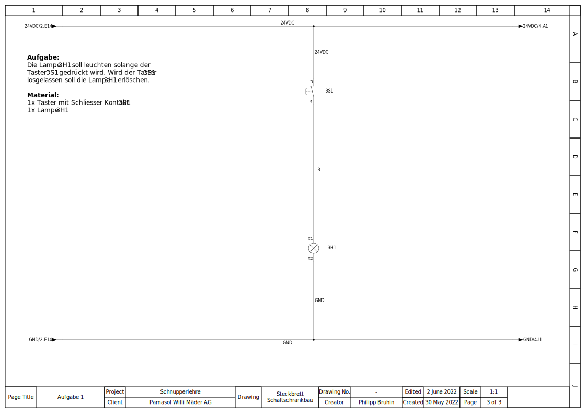

+++
chapter = false
title = "Control cabinet plug board"
weight = 2
+++

## Drawing and wiring schematics

One of the most important tasks of an automation engineer is the **planning** and **wiring of a control cabinet**. These control cabinets can be the size of a shoebox, but also as big as four big closets put together.

The cabinets are filled with complex **electronics**, which are connected with **wires**. If one the hundreds of wires is connected incorrectly, the whole machine won't work. In the worst case, parts could get damaged or destroyed, some of them costing as much as a car.

Because of this, full concentration and attention is needed when drawing these schematics. Work like this needs practice - and that's exactly what we are doing with this excercise.

### Drawing schematics with Capital™ Electra™ X

In a professional workspace schematics are drawn on programs such as [EPLAN P8](https://www.eplan.com/), [Zucken E3](https://www.zuken.com/) or [WS-CAD](https://www.wscad.com/)

For the following project we recommend using the easy-to-use CAD [Capital™ Electra™ X from Radica Software and Siemens](https://radicasoftware.com/). The basic functions, all of them **free to use**, cover everything needed for the occasional use. Additionally, you don't need to install any software since it runs on your **internet browser**. 

{}
On [radicasoftware.com/app/login](https://radicasoftware.com/app/login.php) you can sign up to get access to the drawing editor.
{}

### Standards for drawing schematics

How you draw a schematic and especcially how the symbols need to look is standardized. This has the advantage of having schematics which look the same all over the world and being easy to read for professional electricians.

The standard for these symbols is called [IEC 60617](https://en.wikipedia.org/wiki/Electronic_symbol). The most relevant symbols are found on wikipedia under the following links:

* [General symbols](https://de.wikipedia.org/wiki/Liste_der_Schaltzeichen) (only in german)
* [Electrics/electronics](https://de.wikipedia.org/wiki/Liste_der_Schaltzeichen_(Elektrik/Elektronik)) (german, french, spanish)
* [Measure and control technology](https://de.wikipedia.org/wiki/Liste_der_Schaltzeichen_(Mess-,_Steuer-_und_Regelungstechnik)) (only in german)

Don't worry, you won't need to know all of these from the beginning. There's plenty of time during the apprenticeship.

### Excercises

{}
The schematic with the excercises can be imported [here](https://radicasoftware.com/app/publish/-N3K8EXFBIiQDAMhzdRG/Steckbrett_Schaltschrankbau) as a Capital™ Electra™ X template. If you don't want to work online with [Capital™ Electra™ X](https://radicasoftware.com/) can download the PDF [here](./docs/Steckbrett_Schaltschrankbau.en.pdf).
{}

All excercises are built in the same style. On the top left corner is a description with recommended parts. The 24VDC potential is drawn too. On the top is the plus, on the bottom the minus.

The parts can be placed between plus and minus. Following is the excercise 1 as an example.

**Template excercise 1**

**Sample solution excercise 1**

