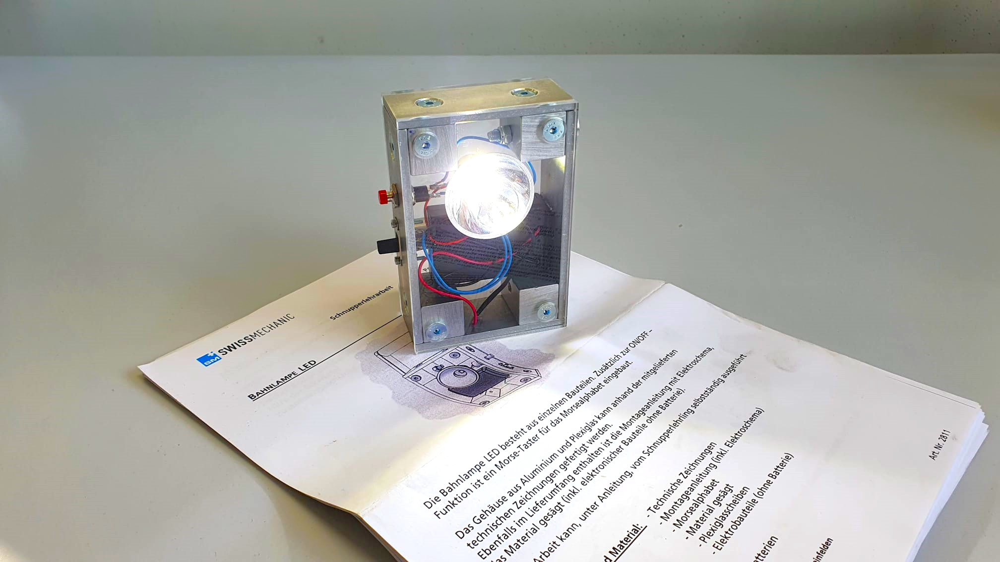

+++
chapter = false
title = "Bahnlampe bauen"
weight = 1
+++

## Das Verschmelzen von Mechanik mit Elektrotechnik

Während deiner Schnupperlehre baust du eine **Bahnlampe** aus Aluminium- und Plexiglasteilen. Dazu kommen Elektronikteile, welche nach einem Elektroschema gelötet, und somit zu einem **elektrischen Schaltkreis** zusammengebaut werden.

Bei der Lampe handelt es sich um einen Bausatz, welcher von der [Swissmechanic](https://www.swissmechanic.ch/) herausgegeben wird. Du kannst die Lampe im Anschluss der Schnupperlehre mit nach Hause nehmen.

Neben der Bahnlampe erhältst du einen authentischen Einblick in unser tägliches Schaffen und die damit verbundenen, spannenden Herausforderungen.
