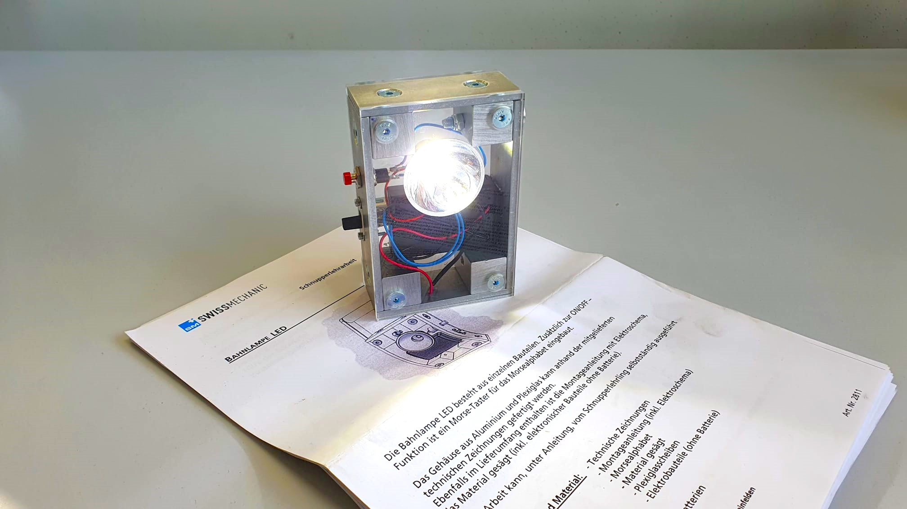

+++
chapter = false
title = "Building a railway lamp"
weight = 1
+++

## The fusion of mechanics and electronics

During your apprenticeship you will build a **railway lamp** with aluminum and acrylic glass parts. In addition to that, electronic parts will get soldered together following a schematic, which turns it into an **electric circuit**.

The railway lamp is an assembly kit issued by [Swissmechanic](https://www.swissmechanic.ch/). You can take the lamp home after the trial apprenticeship.

Additionally to the railway lamp, you'll get an authentic insight into our daily work and all its exciting challenges.